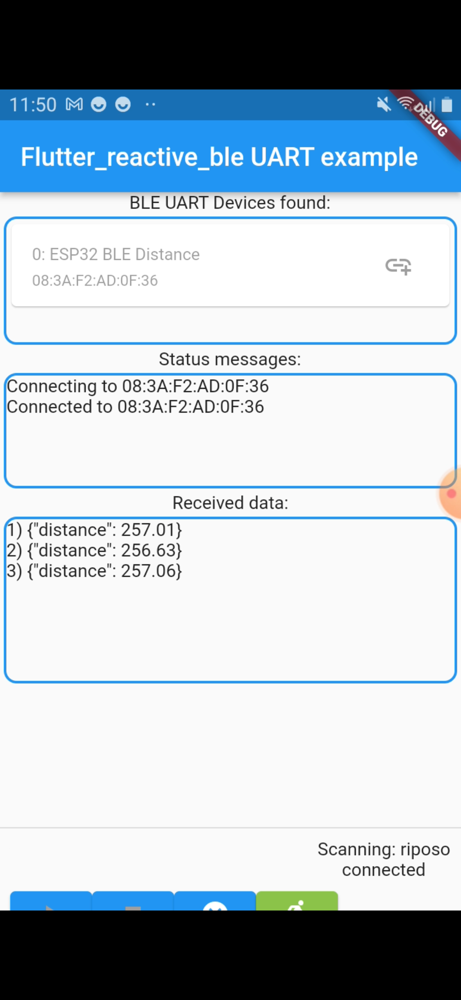

# Applicazione di Gioco Pong BLE

## Descrizione
Questa applicazione Flutter utilizza il Bluetooth Low Energy per connettersi a dispositivi esterni e giocare una versione del classico gioco Pong.

## Funzionalità
- Connessione e gestione di dispositivi BLE.
- Interfaccia utente per visualizzare dispositivi BLE, stato della connessione e dati.
- Logica del gioco Pong con gestione dei movimenti di palla e mattoni.
- Ricezione e invio di dati tramite connessione BLE.

## Utilizzo
### Schermata di collegamento

### Schermata di gioco

